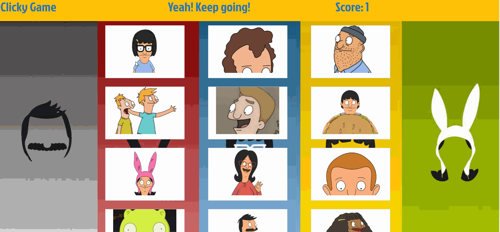

## Clicky-Game

## About
This is an memory game app that solely uses React. The user must click on every character once to win the game. However, if the user clicks on the same character twice in one round, they will lose their score and start the game over. All character cards will shuffle after each click.

## Technology Used
- React
- JSX
- CSS
- Bootstrap
- Node.js

## Author
Adrienne Liu

## Acknowledgements
Danny Chicchon and Matthew Kuh